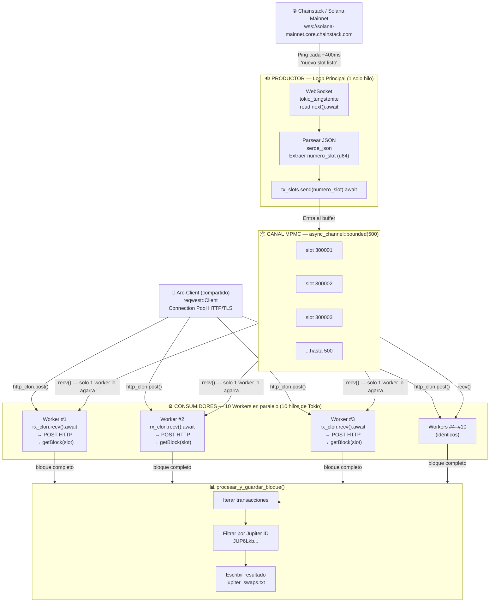
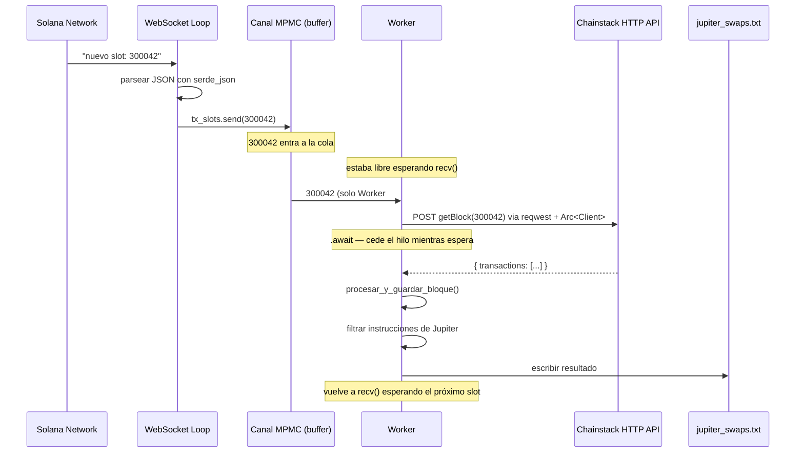

# Diagrama MPMC — Nodo de Solana

## Arquitectura completa del flujo de datos



---

## Detalle del ciclo de vida de un slot



---

## Lo que el Arc hace en memoria

```
                  RAM
                   │
          ┌────────▼────────┐
          │  reqwest::Client │
          │  ┌─────────────┐ │
          │  │ TCP Pool    │ │
          │  │ TLS Config  │ │
          │  │ dns cache   │ │
          │  └─────────────┘ │
          │  strong_count: 11│  ← 1 original + 10 clones
          └─────────────────┘
               ↑  ↑  ↑
         W1    W2  W3  ... W10
       (cada uno tiene un puntero Arc,
        no una copia del Client)
```
